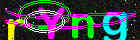
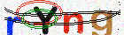
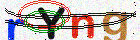

# ic-captcha


[](https://crates.io/crates/ic-captcha)
[](https://codecov.io/gh/ldclabs/ic-captcha)
[](https://github.com/ldclabs/ic-captcha/actions/workflows/ci.yml)
[](https://docs.rs/ic-captcha)
[](https://crates.io/crates/ic-captcha)

**ic-captcha** is a library that generating CAPTCHAs with given random bytes for the Internet Computer.

It is inspired by [captcha-rs](https://github.com/samirdjelal/captcha-rs).

## Usage

See examples and the [API documentation] for more.

### Using mode method

| CaptchaBuilder::mode       | Captcha Preview                                    |
| -------------------------- | -------------------------------------------------- |
| mode(0): dark on light     |  |
| mode(1): colorful on light |  |
| mode(2): colorful on dark  |  |

### Using complexity method

| CaptchaBuilder::complexity | Captcha Preview                                                  |
| -------------------------- | ---------------------------------------------------------------- |
| complexity(1)              |    |
| complexity(5)              |    |
| complexity(10)             |  |

### Using compression

| Captcha::to_base64 | Captcha Preview                                                    |
| ------------------ | ------------------------------------------------------------------ |
| to_base64(10)      |  |
| to_base64(40)      |  |
| to_base64(80)      |  |

## Example

Add the following dependency to the Cargo.toml file:

```toml
[dependencies]
ic-captcha = "0.2"
```

And then get started in your `main.rs`:

```rust
use ic_captcha::CaptchaBuilder;

fn main() {
    {
        let builder = CaptchaBuilder::new();

        let captcha = builder.generate(b"random seed 0", None);
        println!("text: {}", captcha.text());
        println!("base_img: {}", captcha.to_base64(0));

        let captcha = builder.generate(b"random seed 1", None);
        println!("text: {}", captcha.text());
        println!("base_img: {}", captcha.to_base64(0));
    }

    {
        // same as default
        let builder = CaptchaBuilder::new()
            .length(4)
            .width(140)
            .height(60)
            .mode(1)
            .complexity(4);

        let captcha = builder.generate(b"random seed 0", None);
        println!("text: {}", captcha.text());
        println!("base_img: {}", captcha.to_base64(30));
    }
}

```

[API documentation]: https://docs.rs/ic-captcha

## License

Copyright © 2024-present [LDC Labs](https://github.com/ldclabs).

`ldclabs/ic-captcha` is licensed under either of <a href="LICENSE-APACHE">Apache License, Version
2.0</a>.
